---
title: "Linux,yes!"
date: 2020-06-27T17:04:01+08:00
draft: false
toc: true
images:
categories: record
tags:
  - 折腾
---

## 起因

从五月份开始我的个人电脑就开始出现不断死机蓝屏无限重启情况，但是我之前一直加班比较多，所以就没管它，但是六月份加班时间少了，我在家里待着的时间就变多了，于是乎修理它成了必须要做的事情。

## 系统

我一时间找不到这个情况的原因，上网找了一些答案也都不靠谱，但我认为是我系统用了太久的缘故，于是我决定...刷系统。我个人电脑已经很久没用来存放资料了，重要的东西都放在移动硬盘或者网盘上面，刷机对于我来讲代价并不大，也不用备份什么资料啥的。制作U盘启动项...下载镜像...刷入新系统...搞定。但是我刷完之后才发现，问题并没有得到解决，等个三分钟还是死机重启，这个时候我隐约感觉会不会是硬件的问题，但是我电脑已经过保了，修还是得花钱，我打算先把我能试的方法全都试一遍。然后我把win10的家庭中文版，专业版，企业版通通刷了一遍，问题还在，我还不死心，会不会是win10的问题呢？再然后我决定把电脑刷成了ubuntu试试看，用rufus制作U盘...下载ubuntu20.04的镜像...再次刷入系统，哦嚯，开机三分钟又死机了(不过这次么蓝屏，直接黑屏了)。这下子我没辙了，大概率是硬件问题，我这才想起跑到小米笔记本贴吧去看下，结果一看好多和我一样的情况（在这里不得不吐槽下小米的品控是真的LJ）慢慢往下翻了一会，看到有两个评论说，把固态换个插槽或者是重新插拔一下就能解决，我蒙了，搞了一整天白费了啊。立马去楼下五金店买了一套螺丝刀，拆机的时候还搞断了后壳内部的一个卡扣，成功换下固态插到另一个槽，重启，搞定！那现在有个问题，我还要不要切换回win10呢？（重启的时候还是之前的ubuntu）最后决定还是用ubuntu好了，毕竟我在公司也主要是用ubuntu开发，而且bug10真的名不虚传。。

## 优化

我在公司用的ubuntu18.04，放在虚拟机里面打开的，装好之后也没怎么改过，毕竟外面还有个windows，不管什么操作都还能完成，但是当只有ubuntu的话，不改改还真的没法用。

### 软件

#### flameshot

一个超好用的截图编辑软件，相较与系统自带的截图来讲，简直不要太好，截图之后可以编辑，保存，固定图像等等

安装：`sudo apt-get install flameshot`

打开之后可以设置颜色

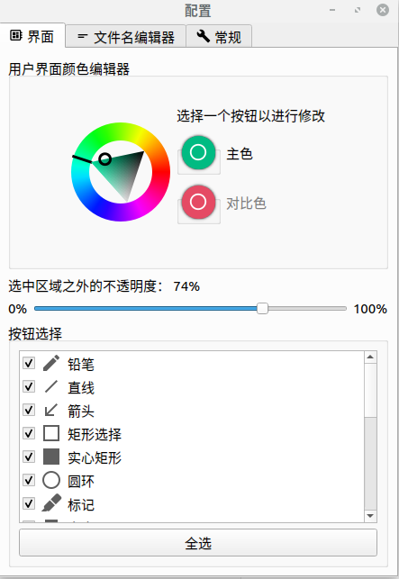

可以设置开机启动

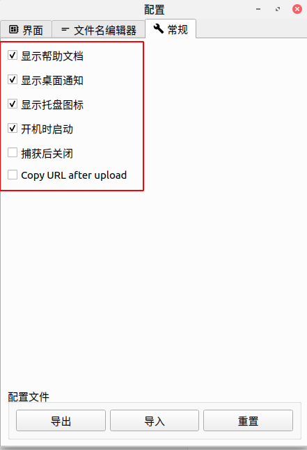

软件本身没有提供快捷键来进行截图，但是可以通过设置ubuntu中的快捷键来达到，打开设置-键盘快捷键-+号，名称可以自己定，命令是`flameshot gui`，快捷键我设置的是`ctrl+ Q`，设置好开机自启和快捷键之后，就可以很方便的截图了


#### wine+微信

微信和qq这样的通讯软件必须是要装的，qq还好，有提供linux版本的，但是微信没有，借助于wine，就能达到在linux下运行exe软件的目的

wine是一个能够在多种 POSIX-compliant 操作系统（诸如 Linux，macOS 及 BSD 等）上运行 Windows 应用的兼容层

具体的安装步骤: 

```
git clone https://gitee.com/wszqkzqk/deepin-wine-for-ubuntu.git
cd deepin-wine-for-ubuntu
chmod +x ./install_2.8.22.sh
./install_2.8.22.sh
wget https://mirrors.aliyun.com/deepin/pool/non-free/d/deepin.com.wechat/deepin.com.wechat_2.6.8.65deepin0_i386.deb
sudo dpkg -i deepin.com.wechat_2.6.8.65deepin0_i386.deb
sudo apt install fonts-wqy-microhei fonts-wqy-zenhei # 解决中文字体变方块的问题
```

这样装完之后打开为微信扫码就能使用了，但是有个小问题，从界面退出微信和wine之后，还会有wine和微信的进程残留，微信的消息提示音也不会消失（即便已经退出微信了）必须手动kill或者等待关机重启才会消失

#### torjan-qt5

这是一款能让你更加自由的软件（你懂得），其实还有很多方法，但是我用的这个，亲测有效，具体使用方法可以看[torjan-qy5](https://github.com/Trojan-Qt5/Trojan-Qt5), 我就不多介绍了

#### Typora

这个是一个markdown编辑器，虽说有很多开发软件就已经支持md的书写了，但是这个颜值高阿，而且写起来很舒服，这篇博客就是用这个写的，安装方法[Typora](https://www.typora.io/#linux)

****

剩下的一些包括网易云音乐，chrome浏览器之类的都可去官网下载linux版本

### 界面美化

#### 插件安装

第一步：安装gnome-tweaks

`sudo apt-get install gnome-tweak-tool`

打开的截图如下（图已经是我加上各种优化后的了）：

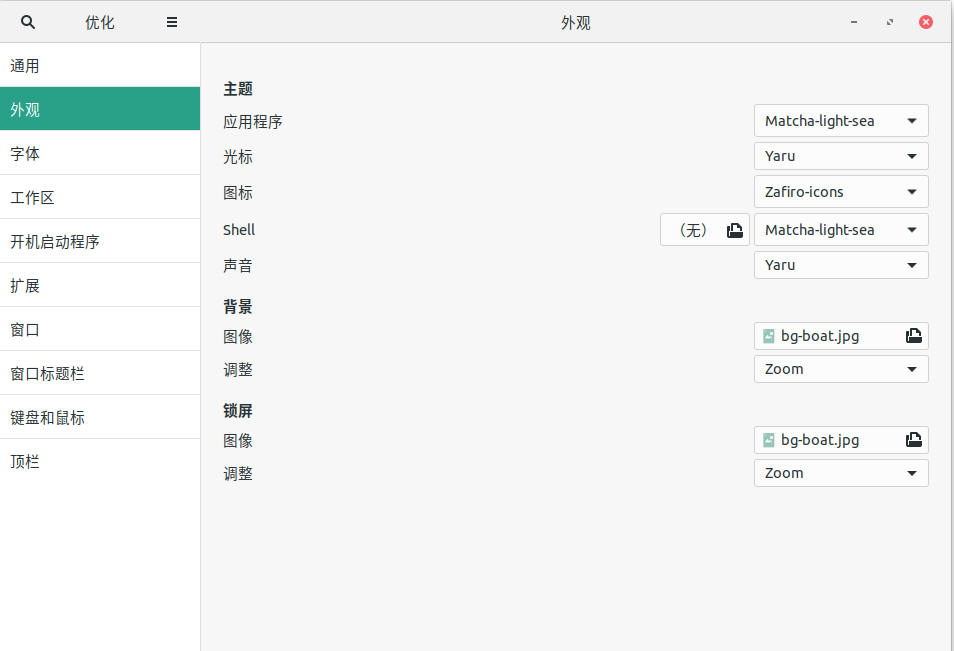

第二步：chrome浏览器安装GNOME shell integration拓展插件

这个需要用到上面提到的自由软件了，打开谷歌商店搜索就能下载，装好后如图：

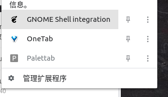

第三步：本地安装gnome-shell-extensions（非必要）

`sudo apt-get install gnome-shell-extensions`

这个是一个已经封装好的gnome插件的集合，里面大概包括8-10个插件可用，当然也可以不装，后面一个个装自己喜欢的插件

装完之后大概是这样

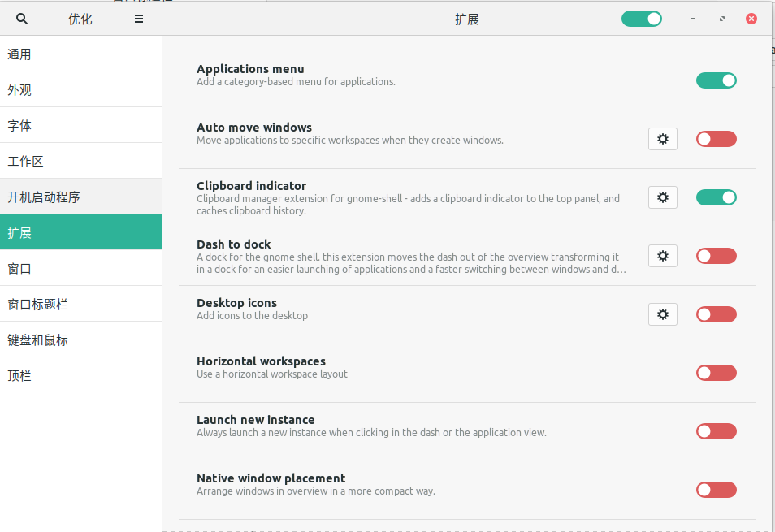

第四步：去[gnome的插件市场](https://extensions.gnome.org/)找到想要的插件然后下载，页面大概是这样: 

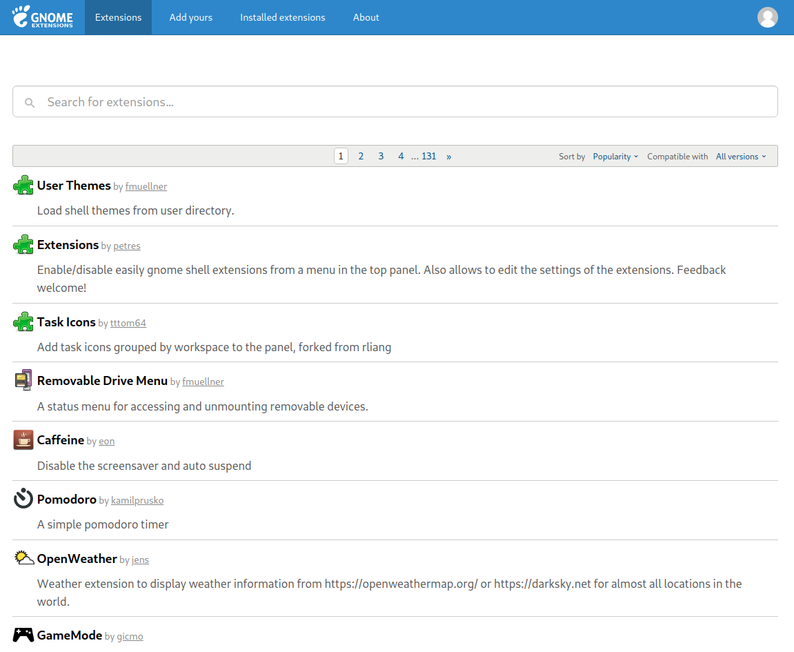

进入某个插件的详情页面之后，右边会有一个开关按钮，点击OFF转换为NO，会出现询问是否安装到本地的小弹窗，点击yes

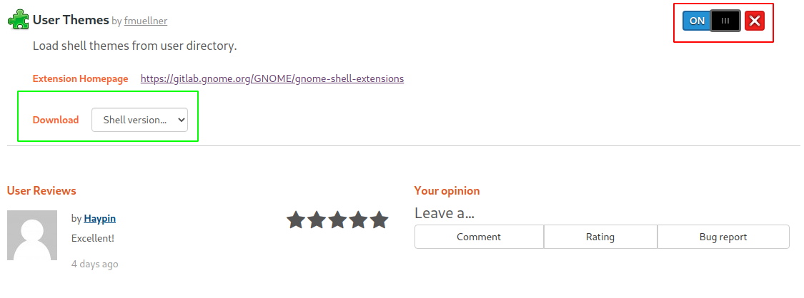

有的时候会有点击了按钮，但是并没有出现弹窗让本地安装，这个时候就需要手动下载了，在上图的版本按钮中选择相应的进行下载，然后将解压出来的文件夹放到本地的`/usr/share/gnome-shell/extensions`, 这个文件夹里面存的就是已经安装到本地的各种插件，像这样：

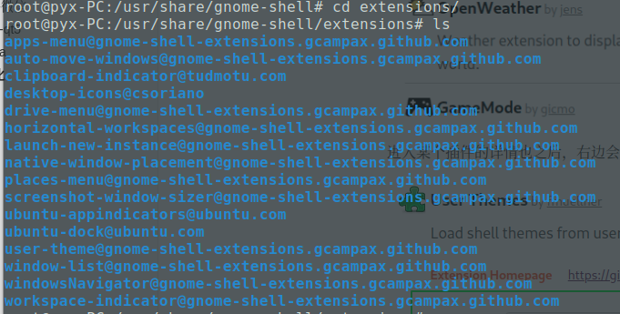

通过这样下载下来的插件可以在本地的tweak-tool工具里面进行管理，在ubuntu的所有软件中搜索tweak或者优化就能打开

推荐下我安装的那些比较有用的插件吧：

1.User Themes

这个插件是必须要装的，用来更换ubuntu的主题，图标，字体，开机界面什么的，下面会再次介绍

2.Topicons Plus

这个是用来让打开的软件以小图标的方式出现在顶部状态栏的

3.NetSpeed

用来显示实时网速

4.Clipboard indicator（很好用）

用来保存复制粘贴的记录，比如想一次复制很多条数据，但是不想来来回回的cv，这个插件就能把之前复制过的保存在右上角的下拉选项

5.dash to dock

让屏幕的下方的软件列表在应用全屏时隐藏，还能设置显示时候的透明度，但是存在和后续安装的主题发生冲突的问题，会显示出两个dock栏，这个自己决定关不关吧

#### 主题安装

可以去[主题商店](https://www.gnome-look.org/)选择想要安装的主题，如图：

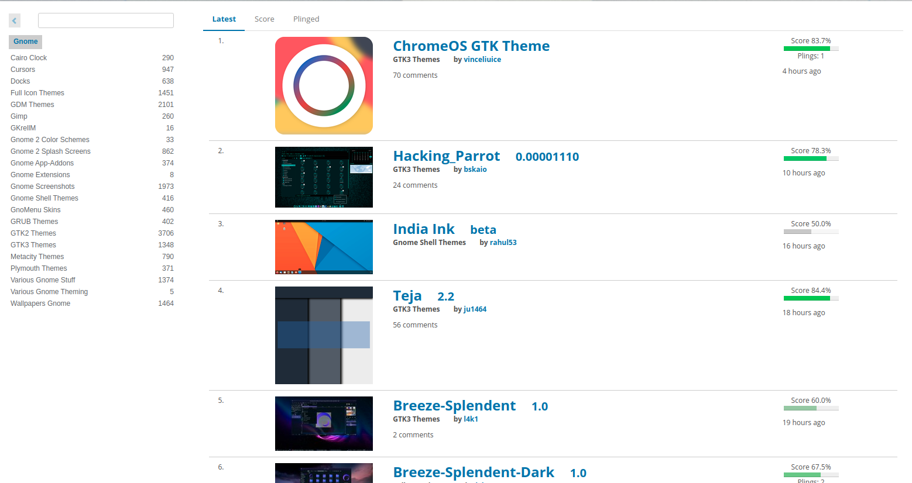


其中左侧的这么多选项里面，GTK2和GTK3 Themes代表整体的风格样式，Full Icon Themes指的是图标主题风格，除此之外还有GDM（锁屏样式），Plymouth Themes（开机动画的样式），Wallpapers Gnome（壁纸），不过我就改了GTK和Icon还有壁纸，其他的懒得折腾了

首先，点进去一个主题，选择对应的文件，如果是GTK主题，那么就把下载解压后的文件放在~/.themes文件夹下（没有就建一个），如图：

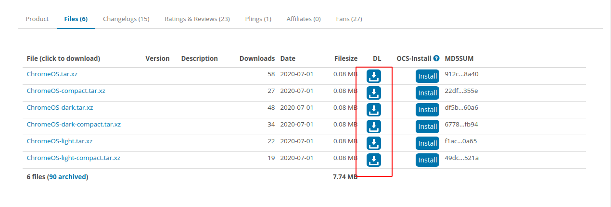

如果下载的是icon主题，就把下载解压后的文件放在~/.icons文件夹下面，比如：

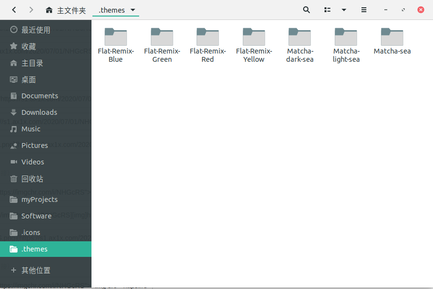

当这些做好之后，重新打开tweak（本地软件搜索tweak或者优化），就能在如下图所示的地方看到刚才导入的主题了，并且可以选择：

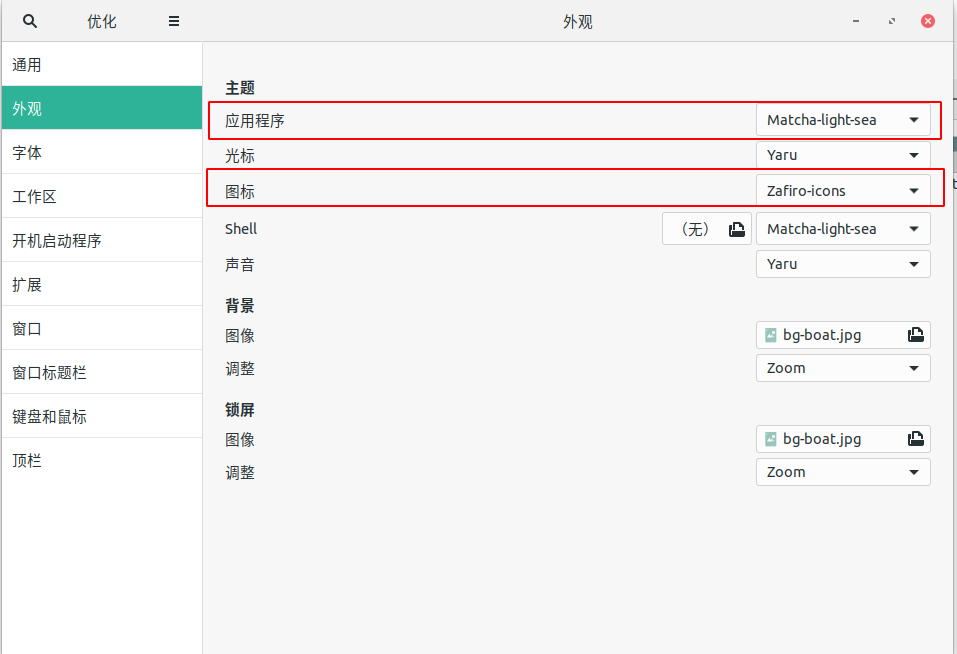

好了，至此大概的优化项就差不多了，可以看下初步的效果：

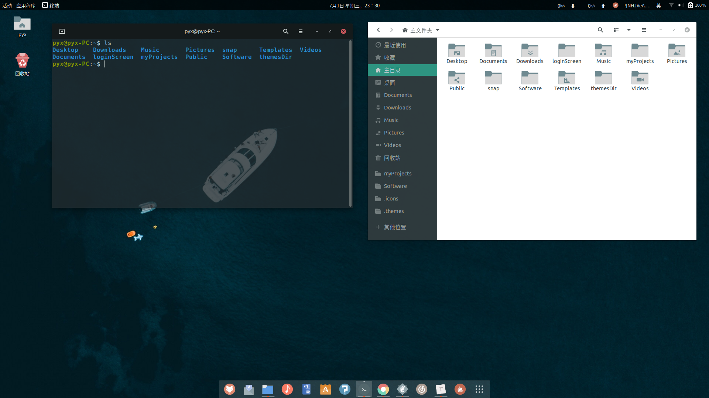

shell的界面设置了半透明，这个本地就能设置，图标主题选择了一款扁平灰色调的主题，感觉还是很不错的

## 总结

这次折腾电脑搞了好几天，从软件到硬件（拆机）都折腾了一遍，什么都是从头开始，照着网上教程来，很多都是猜着来做的，不过最后的结果还是挺好的

linux比windows的确流畅了不少（mac太贵了），而且很多配置文件自己就能弄，不象windows下一个注册表就搞半天

总之，这次搞机体验相当不错，如果后面还有继续折腾的地方我也会写点新的东西的，Linux, Yes!


peace

